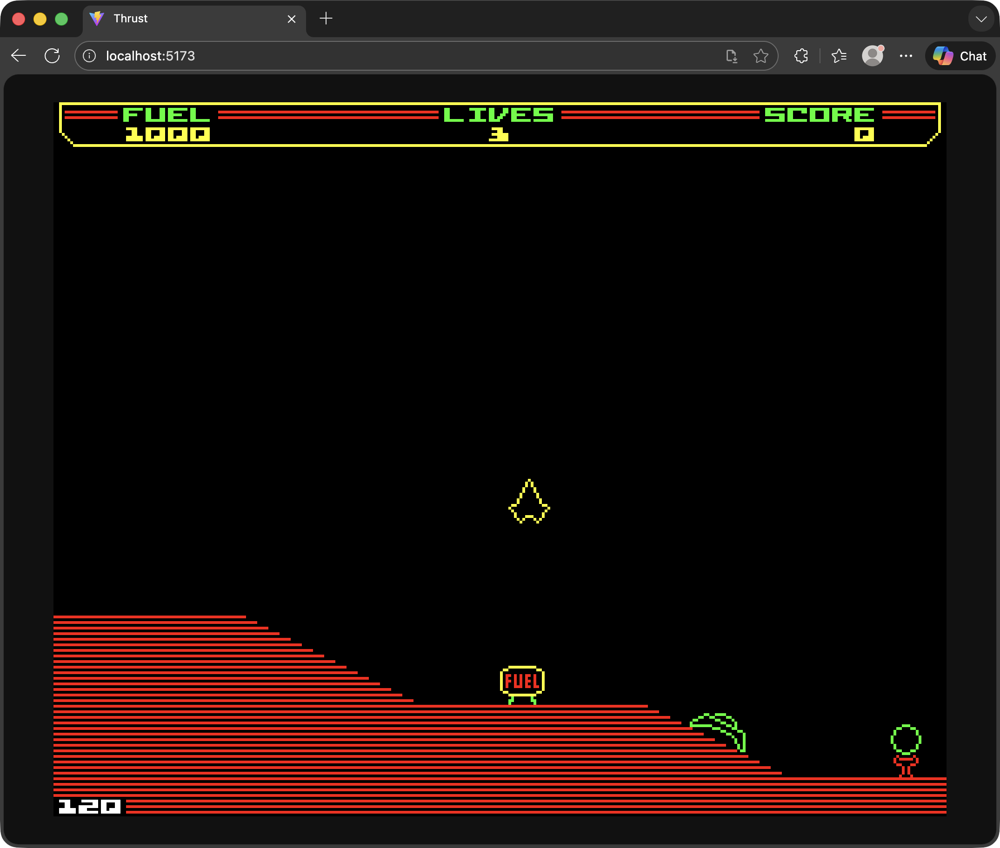

# Thrust

A TypeScript recreation of **Thrust** (BBC Micro, 1986) by **Jeremy C. Smith**, built with HTML5 Canvas and Vite.

Thrust is a gravity/inertia game where you pilot a ship through caverns, collecting fuel, avoiding turret fire, and retrieving a pod from deep underground — all while fighting gravity and momentum.

This conversion focuses on authenticity — recapturing the look and feel of the original BBC Micro game as closely as possible, using constants, algorithms, and behaviours extracted directly from the 6502 source code.



## Acknowledgements

- **Jeremy C. Smith** — author of the original *Thrust* for the BBC Micro (1986)
- **Kieran Connell** — annotated 6502 disassembly of the original game, which this project uses as its primary reference for physics, scrolling, and game logic: [github.com/kieranhj/thrust-disassembly](https://github.com/kieranhj/thrust-disassembly)

## Running

```bash
npm install
npm run dev
```

## Controls

| Key | Action |
|-----|--------|
| **A** / **D** | Rotate anticlockwise / clockwise |
| **W** | Thrust |
| **1**–**6** | Switch level |

## Technical Details

The game faithfully reproduces the original's behaviour using constants and algorithms extracted from the 6502 disassembly:

- **Physics** — Fixed-timestep simulation at the original's effective 18.75 Hz rate (6 active slots per 16-tick window at 50 Hz PAL). Gravity, thrust, and drag use the original Q7.8 fixed-point lookup tables. The 32-step rotation system is preserved.
- **Rendering** — 320x256 internal resolution with integer scaling. Terrain is drawn using scanline-parity polygon fill (every other line) to match the BBC Micro's characteristic look. Sprites are runtime-tinted to match per-level colour schemes.
- **Collision detection** — Pixel-perfect, using an offscreen canvas buffer with colour-coded sentinel values for terrain, turrets, fuel, the power plant, and the pod.
- **Scrolling** — Dead zone camera system matching the original's behaviour: the viewport only scrolls when the tracked midpoint exits a central dead zone, with velocity-matched scroll speed and smooth brake-zone deceleration.

## Project Structure

```
src/
  main.ts          Entry point, frame loop, input handling
  game.ts          Game state, tick loop, reset
  physics.ts       Fixed-timestep physics (from disassembly)
  scroll.ts        Dead zone scrolling camera
  rendering.ts     Terrain, objects, sprites, status bar
  collision.ts     Pixel-perfect collision detection
  levels.ts        Level definitions (terrain, objects, turrets)
  shipSprites.ts   Sprite loading and mask extraction
  font.ts          BBC Micro font data
  sprites/         Ship rotations, turrets, fuel, power plant, pod
```

## Building

```bash
npm run build
```

Output is written to `dist/`.

## Licence

MIT License. Copyright (c) 2026 James Randall. See [LICENSE](LICENSE) for details.

The original *Thrust* is copyright Jeremy C. Smith.
